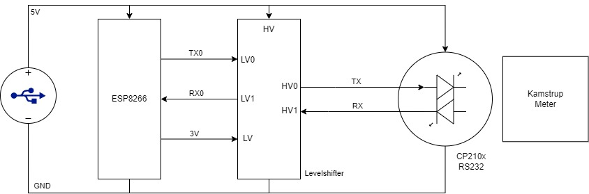

# ESP8266SerialBridge
Serial Wi-Fi Bridge for Kamstrup 403 Home Assistants Integration

## Usage

* Requirements
    * ESP8266/ESP32 devkit module (a cheap clone can do)
    * [IR Eye with RS232 interface](https://www.aliexpress.com/item/1005005630726621.html?spm=a2g0o.order_list.order_list_main.17.70c71802tpHpcY)
    * [Logic Level Converter 3V3-5V](https://www.aliexpress.com/item/1005005984772131.html?spm=a2g0o.order_list.order_list_main.11.2f711802RFZWUl)
    * Some power for the ESP Module and CP2101 IR Eye

### Hardware

Power the ESP Module with USB, and power the IR Eye with the same USB 5V Power.
Levelshift the ESP 3V3 logic with the 5V logic from the IR Eye. (The IR eye might support 3V3, so a levelshifter is maybe not needed)
The CP210x IR eye is connected to the Kamstrup 403 IR Eye.

### Software
1. Open the .ino file in Arduino IDE.
2. Insert your Wi-Fi SSID and Password in the code.
3. Go to Preferences and add Additional boards manager URLs:
```bash
http://arduino.esp8266.com/stable/package_esp8266com_index.json,https://dl.espressif.com/dl/package_esp32_index.json
```
4. Choose your COM port and Board `Generic ESP8266 Module` or whatever the board you use.
5. Press Upload

### Home Assistent
Install this [ha-kamstrup_403](https://github.com/golles/ha-kamstrup_403)

When starting the integration and are asked for Serial Port, input the IP of the ESP and port, 8880 for UART0 and 8881 for UART1.

```bash
socket://1.2.3.4:8880
```

Find the IP of your ESP module via a [IP scanner](https://www.advanced-ip-scanner.com)

I will recommend to configure your DHCP Server in your Router to set the IP of the Module, so it is always the same. Can typically be done, by defining the MAC-address of the module together with an IP.