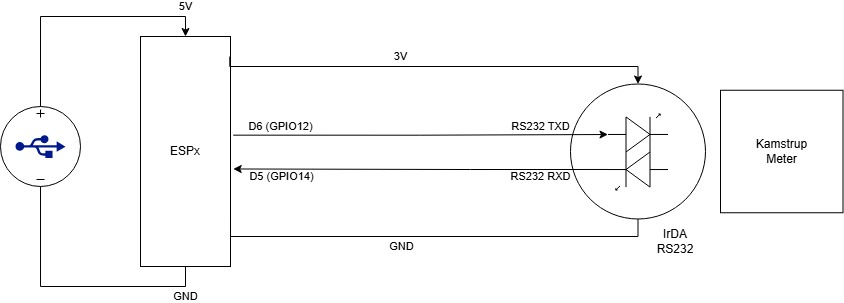
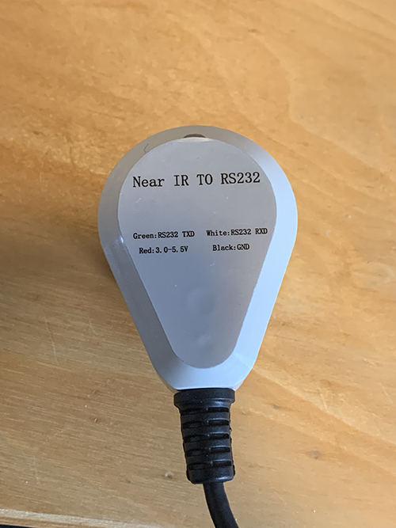
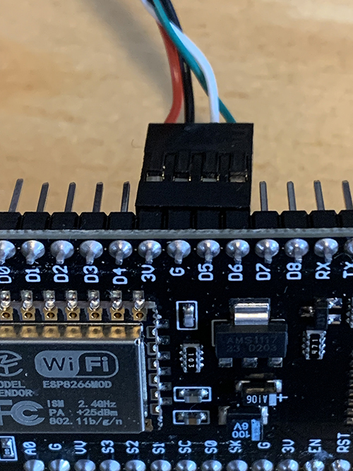

# ESP8266/ESP32 Wi-Fi Serial Bridge
Serial Wi-Fi Bridge for Kamstrup 403 Home Assistants Integration

This sketch creates a WiFi <-> UART bridge using the ESPxxx module. 

The sketch uses SoftwareSerial to create a COM port for the IrDA communication. 

The sketch creates a TCP server and listens for incoming connections. 

The sketch reads data from the SoftwareSerial port and sends it to the 
connected clients. The sketch also reads data from the connected clients 
and sends it to the SoftwareSerial port.

The IrDA should be connected to GPIO14 (D5) and GPIO12 (D6) and 3V and GND.

When powered up, the IrDA Light can be checked with a iPhone front camera,
and should only light up when data is sent. If not the inverted flag should be toggled.

## Usage

* Requirements
    * ESP8266/ESP32 devkit module (a cheap clone can do)
    * [IrDA with RS232 interface](https://www.aliexpress.com/item/1005005630726621.html?spm=a2g0o.order_list.order_list_main.17.70c71802tpHpcY)
    * (optional) a case for the ESP.

### Hardware

Power the ESP Module with USB, and power the IR Eye with the 3V Power from the Devkit.

<div style="display: flex; justify-content: space-around;">
  
  
</div>

### Software
1. Open the .ino file in Arduino IDE.
2. Insert your Wi-Fi SSID and Password in the code.
3. Go to Preferences and add Additional boards manager URLs:
```bash
http://arduino.esp8266.com/stable/package_esp8266com_index.json,https://dl.espressif.com/dl/package_esp32_index.json
```
4. Choose your COM port and Board `Generic ESP8266 Module` or whatever the board you use.
5. Press Upload

### Home Assistent
Install this [ha-kamstrup_403](https://github.com/golles/ha-kamstrup_403)

When starting the integration and are asked for Serial Port, input the IP of the ESP and port, 8880.

```bash
socket://1.2.3.4:8880
```

Find the IP of your ESP module via a [IP scanner](https://www.advanced-ip-scanner.com)

I will recommend to configure your DHCP Server in your Router to set the IP of the Module, so it is always the same. Can typically be done, by defining the MAC-address of the module together with an IP.